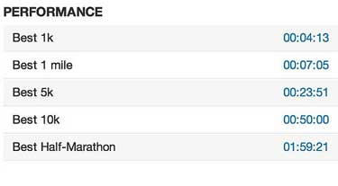
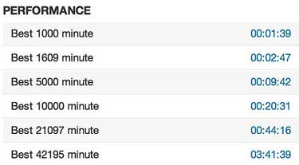

Now I like Strava, it's a great place for to upload the ridin' and runnin' I've been doing. Something I particularly like is it keeps track of your best times at certain distances. Which was great until recently.

##Where's My Stuff Gone?

This is what I'm used to seeing

Just recently I've been liking it a lot less as the above kept changing to this nonsense:

Man, what's all about? I got an ex-work colleague with an increasingly good 5km time and I needed to know how close has getting to my best. I go to Strava to find out and it's just banging on about BEST 10000 MINUTE. That's no good. It wound me up a bit.

"Gaz, you're such a winger, it's just a bug and it's a free service" you say "stop bellyaching about it". Well the thing is this problem only just started after I actually coughed up the $59 for the Premium service.

I don't mind paying for things I enjoy and find useful, it helps keep them going and IMHO only fair. Honestly, I wish I could have paid something for [Google Reader](http://www.google.co.uk/reader)
if it'd meant avoiding [what's going to happen to that service](http://blogs.independent.co.uk/2013/05/07/what-to-do-without-google-reader/) later on this year.

So yeah, I felt a little entitled so instead of just grumbling actually submitted a bug and to be honest it's not gone well.

* First submission and it got fixed
* And then went wrong again
* Moaned again, wasn't fixed and the bug was closed
* Complained and told that tracking issues were closed if it was a known bug (WTF?)
* And then told it was the [fault of my Garmin 110](http://pastebin.com/TL33x7fq )

I used to be a programmer, it's pretty clear that this is an issue with Strava rather than Garmin. Which has left me feeling a bit fobbed off, no idea when this will be fixed or if it's going to happen again.

And the interesting thing is it's paying for the service that's the root my unhappiness. There's nothing much in the way of extra features so it's just a gesture of support on my part. But because I've paid there's an increased expectation and I guess in turn the probability of being unsatisfied goes up as well.

Shit Sandwich all around really.
