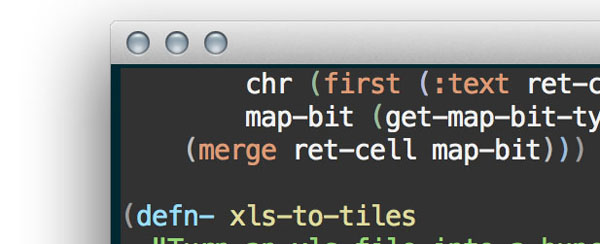

 

I wanted to write something about my beginnings on clojure which I'm finding a lot of fun. Here I'm a bit astounded how terse and elegant you can make your code when you start working with the powerful list processing library. It's noddy stuff but new to me and writing it down helps me process what I've done :D

## Achieve More / Write Less
The thing I've found interesting is the more work you do, the more idiomatic and elegant the code gets then the more you source shrinks by.

This was cool. I had an array of arrays that represented a bunch of x,y co-ordinates, something like this:

<pre class='prettyprint lang-clj'>
(def xy-pairs [
               [1 11]
               [7 9]
               [10 1]
               ])
</pre>

I needed to scan through and get the maximum x and y from the set, in this case it'd be [10 11]. In C++ you'd I'd probably something like this

<pre class='prettyprint' lang-c++>
using namespace std:
typedef std::pair<unsigned int, unsigned int> Pair;
typedef std::vector< Pair > PairVector;

Pair findMax(PairVector const & _vec) {
  Pair result(0,0);
  
  for( auto const & p : _vec) {
    result.first = max(p.first, result.first);
    result.second = max(p.second, result.second);
  }

  return result;
}
</pre>

I haven't compiled this, it probably doesn't work :D My first pass in clojure, was pretty much the above but I knew it wasn't right and that for a transform like this there would be some kind of solution based around using sequence manipulators and function composition.

## So How Would You Clojure It?
Now it took a while and I come up with this:

<pre class='prettyprint lang-clj'>
(defn max-sequences [sx]
  (map #(apply max %) (apply map list sx)))
</pre>

It works and unlike the C++ version is specific to co-ordinate pairs and works with a sequence of any uniformly sized elements. Send it a load of x,y,z pairs and you get the correct result.

There's two main parts. First it uses map to take the array of xy pairs and turn it into two lists, one of x and one of y. That's what the (apply map list sx) bit at the end of the line does. apply turns the list sx into a load of arguments for (map list).

So how does it work? I'll try and break it down into bits as that's how lisps work, nested functions that reduce down to a final answer. So first the bit at then of the function. How how does that run?

<pre class='prettyprint lang-clj'>
  (apply map list sx)
</pre>

First sx is substituted with whatever has been passed to the function. If we passed the test array it would be the equivalent of the below.

<pre class='prettyprint lang-clj'>
  (apply map list [[1 11] [7 9] [10 1]])
</pre>

That calls apply with the rest of the parameters. Apply will convert the array at the end of the function in a bunch of parameters for the preceding functions. In this case it generates a function like this:

<pre class='prettyprint lang-clj'>
  (map list [1 11] [7 9] [10 1])
</pre>

Map is function that will iterate through an array applying another function to it and gather up all of the results into a list. If you pass it a load of arrays as above the first iteration will take the first item from each of the arrays, the 2nd iteration the 2nd and so on. The two iterations come out like this

<pre class='prettyprint lang-clj'>
  ;;; Iteration one 
  (list 1 7 9)

  ;;; Iteration two 
  (list 11 9 1)

</pre>

map returns the list of the results of each iteration so now have this:

<pre class='prettyprint lang-clj'>
  ( (1 7 10) (11 9 1))
</pre>

A list containing two lists, one of x and one y. So after all of that that makes the original statement:

<pre class='prettyprint lang-clj'>
(defn max-sequences [sx]
  (map #(apply max %) (apply map list sx)))
</pre>

has now decomposed to this:

<pre class='prettyprint lang-clj'>
  (map #(apply max %) ( (1 7 10) (11 9 1)) )
</pre>

We're getting there! Now map runs each of the two lists through this function #(apply max %). This is the first iteration of map:

<pre class='prettyprint lang-clj'>
  (apply max (1 7 10))
  ;;; and then apply creates this function call
  (max  1 7 10 )
  ;;; which returns
  10
</pre>

Map then does the same thing for the second list, the one full of y values and eventually returns of a list of the results:

<pre class='prettyprint lang-clj'>
  (10 11)
</pre>

The max x and y of the original list of co-ordinates. All from this

<pre class='prettyprint lang-clj'>
(defn max-sequences [sx]
  (map #(apply max %) (apply map list sx)))
</pre>

## Wow!

Now I'm a nascent function / lisp programmer and there's likely an even better way to do this, probably with a reduce or something. Even so I'm happy I feel I'm getting this now and wiring this down has helped me order my thoughts about it a bit more.

I like that the solution is terse and I like that it would work if I sent it a list of any dimensional co-ordinates.

So the down sides? The code isn't an easy read, it took me longer to write than it would if I were writing C++, made my brain hurt a bit and the resulting code is probably slow as mollases.

It was a horror to debug, well until I found about [this incredible thing](http://www.lighttable.com/ ) 

Sounds terrible. But it's a lot of fun and I haven't had as much joy out of a single line of text for quite a while :) 
